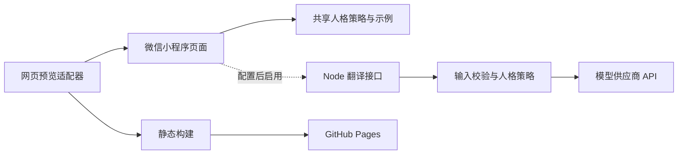

# MBTI 翻译器 / MBTI Translator

把你想说的话，转换成对方更容易理解的表达，同时保留真实意思。

[在线体验](https://xiyue-w-work.github.io/mbti-translator/) · [资料与证据](docs/research/mbti-communication-evidence.md) · [自动检查与发布](https://github.com/xiyue-w-work/mbti-translator/actions)

> 当前公开版本为 **人格化场景示例**，不是通用 AI 翻译服务。选择不同接收方 MBTI 可比较表达；自定义原话的生成需接入模型服务。

## 体验方式

选择恋爱、职场或日常场景 → 选择双方类型 → 点击“试试一个例子” → 查看三个版本。在结果页直接切换接收方，比较正文并查看资料依据。

## 架构



公开网页只运行离线示例，无模型密钥、无数据库，也不会把输入发送给 AI 服务。服务端代码保留在仓库，方便以后接入真实改写。MBTI 是理论性偏好参考；中文编辑策略尚未通过接受度实验验证。

## 技术与项目结构

| 路径 | 职责 |
| --- | --- |
| `miniprogram/` | 原生微信页面、共享策略、场景示例与请求适配 |
| `preview/` | 复用 WXML/WXSS 的浏览器预览适配器 |
| `server/` | 可配置模型接口、校验、超时与开发限流 |
| `scripts/build-demo.js` | 生成无服务端依赖的 `dist/` |
| `tests/` | 18 项自动化测试 |
| `docs/research/` | 来源、编辑推导与证据边界 |
| `.github/workflows/pages.yml` | 测试、构建与自动部署 |

Node.js 22，无第三方运行依赖。

```bash
npm test       # 校验核心行为
npm run demo   # 本地交互预览
npm run build  # 构建静态分享版
```

## 发布方式

当前使用 GitHub Pages，主分支通过检查后自动发布 `dist/`；PR 仅检查，不发布。也可在 Vercel 导入该仓库，构建命令使用 `npm run build`，输出目录设为 `dist`，部署同一静态示例。当前不包含 Neon、Cron 或项目雷达功能；它们不属于这个沟通工具的需求。


微信原生小程序第一版：恋爱、职场、日常三个场景；双方 MBTI；改写原话或组织想法；三个结果版本与继续调整。

## 当前交付状态

已实现小程序页面、内置场景示例、可配置 AI 服务接口及自动化测试。默认是明确标注的演示模式：场景示例会随接收方 MBTI 改变，结果页可直接切换比较；任意原话、发送者 MBTI 与自由文本偏好尚需真实模型处理。真实模型尚未接入，尚未在微信开发者工具编译或真机验收，也尚未提审发布。

## 在微信开发者工具体验

1. 安装并打开微信开发者工具，导入本仓库根目录。
2. 使用自己的 AppID；项目里的 `touristappid` 是本地体验配置，不是可发布的 AppID。
3. `miniprogramRoot` 已设为 `miniprogram/`，无需 npm 构建。
4. 默认 `miniprogram/config.js` 的 `demoMode: true`，无需服务器即可体验三个场景的示例结果及复制。

工程结构参考 [微信官方示例工程](https://github.com/wechat-miniprogram/miniprogram-demo/blob/master/project.config.json)。

## 接入真实 AI

需要 Node.js 22 或更新版本，无第三方运行依赖。

1. 复制 `.env.example` 为 `.env`，填入自己选定服务商的完整 HTTPS Chat Completions 地址、模型名称和密钥。密钥只放在服务端；`.env` 已排除 Git 跟踪。
2. 服务商需兼容 `messages`、`response_format: {type: "json_object"}`、`max_tokens` 及 `choices[0].message.content` 响应格式。不同供应商是否支持这些字段，需要接入时验证。
3. 运行 `npm start`，默认仅监听 `127.0.0.1:8787`。
4. 将 `miniprogram/config.js` 中 `demoMode` 设为 `false`，`apiBaseUrl` 设为服务端地址。桌面本地调试可用 `http://127.0.0.1:8787`，开发者工具需要仅在本地调试时关闭合法域名校验。
5. 真机和发布环境使用自己的 HTTPS 服务域名，并完成小程序后台域名配置；手机上的 `127.0.0.1` 不是开发电脑。`DEMO_MODE` 必须为 `false`。

`GET /health` 用于健康检查，`POST /api/translate` 返回三个表达版本。请求正文有 24 KiB 限制；每个直连 IP 每分钟最多 20 次。模型请求 25 秒超时；错误不会包含供应商密钥或原始供应商响应。

该服务器目前用于本地开发与受控联调。公开部署前需接入微信登录身份验证及按用户配额、部署级限流和反向代理策略；当前内存 IP 限流会在重启后清空，多实例不共享额度，也不读取未经校验的代理头。不要把未鉴权的开发接口直接公开作为付费模型入口。

## 数据与翻译边界

原话仅保留在当前小程序进程及页面状态中，不写本地存储或聊天数据库。真实模式会把输入发送给你部署的服务及配置的模型供应商；接入后必须核实该供应商的数据保留政策，完成隐私告知。应用服务端不记录请求正文，部署平台日志设置需单独核实。

服务端提示词要求保留事实、诉求、拒绝和边界，把 MBTI 视为初始参考。模型生成仍需通过实际样本验收；结构校验和提示词不能保证每次生成都完整遵守语义规则，也不构成提示词注入绝对防护。

## 验证

运行 `npm test`。测试覆盖输入限制、无效模型响应、未配置模型时明确失败、HTTP 请求与限流、请求失败保留原文，以及继续调整仍携带原始诉求。

开发者工具与真机待验收项目：

- 三个场景、两种模式、全部 MBTI 及不确定选项，交换双方。
- 空白输入禁用，示例填入，2000 字限制，键盘不遮挡输入。
- 三个结果卡片、原话展开、复制、返回编辑。
- 接入真实模型后验证更简短／更温和／更坚定；失败保留结果并能重试。
- 小屏和大字号中文布局；拒绝邀请、表达不满、工作延期等实际语义样本。

## 提审前还需要

用户的小程序账号与 AppID、模型供应商、服务域名与部署环境；微信开发者工具编译与真机验收；按届时官方要求核实主体、服务类目、备案、生成式 AI 相关要求、隐私声明及内容安全接入。当前代码不是已获审核的发布包。

## 浏览器交互预览

运行 `npm run demo`，打开 http://127.0.0.1:8790 。预览适配器直接读取本项目的 WXML、WXSS、页面逻辑及场景示例，仅实现本项目所用的模板子集；不是微信运行时，也不代替真机验收。浏览器预览强制使用离线示例，不会调用真实 AI。

人格策略与资料依据见 [研究记录](docs/research/mbti-communication-evidence.md)。规则为基于资料的中文编辑推导，未宣称经过接受度实验验证。
